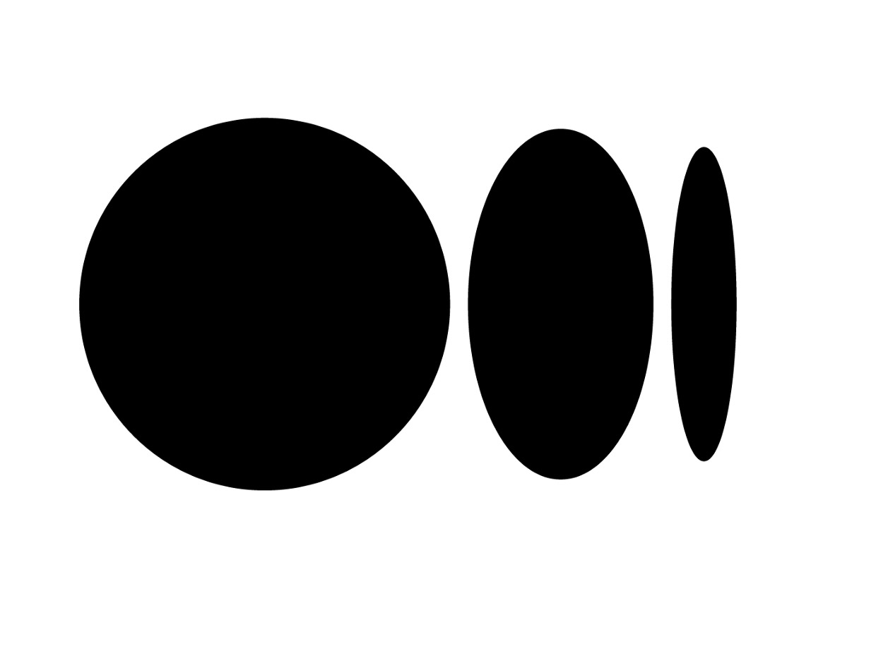

<h1 align="center">Hey!! I am Nilay Gaitonde</h1>

## About Me

- 📚 I am currently learning **Python**
- ✉️ You can reach me at **nilay0160@gmail.com**
- 🏎 My favourite sport is **F1**
- 🍿 I love watching **Movies** (my favourite one is Portrait of a lady on fire)

## My Socials

 

 
 

## My blogs

 
- <a href="https://nilaygaitonde.medium.com/stagehand-a-discord-bot-to-make-your-movie-nights-better-ee4dfa3ff3c0">How to make a discord bot</a>

 

## Languages I am familiar with

 

 
 

## Softwares I am familiar with

 

